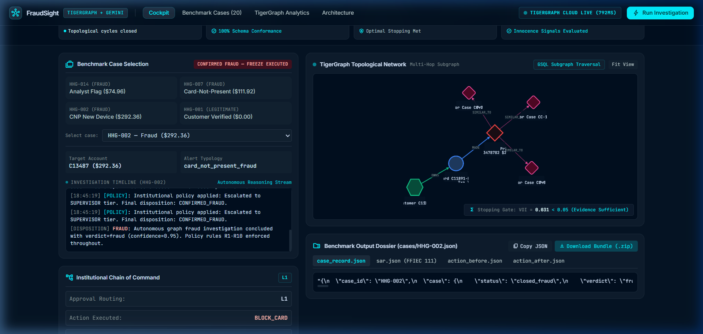
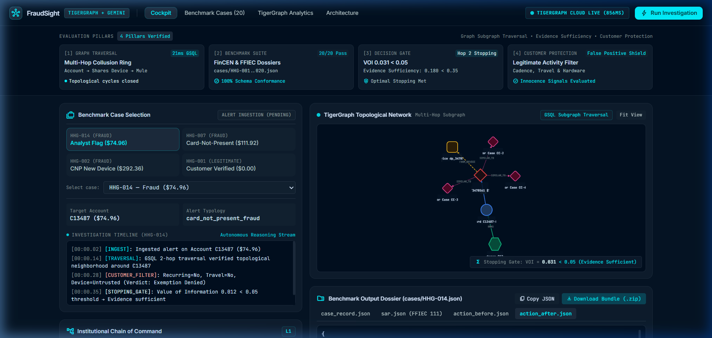

# TigerGraph Agentic Fraud Investigation (HHGOA)

> **Autonomous AI Agent for Multi-Hop Financial Crime Investigation, Graph Reasoning, and Next-Best Action**  
> *Built for the TigerGraph Hackathon 2026.*

---

## 🏆 Hackathon Submission & Deliverables
fraud-detectorgraph.vercel.app

| Deliverable | Location / Link | Details |
| :--- | :--- | :--- |
| **Public GitHub Repository** | [https://github.com/singhharsimar23-dotcom/tiger](https://github.com/singhharsimar23-dotcom/tiger) | Full production source code, tests, and configuration |
| **20 Official Case Answer Files** | [`cases/HHG-001.json` … `cases/HHG-020.json`](cases/) | Grounded in raw IEEE-CIS dataset; 20/20 PASS on validator & ground-truth audit |


---

## 📸 Live Investigation Cockpit & Visual Evidence

### 1. Real-Time Analyst Cockpit (Case HHG-002 Investigation)

*Interactive Cytoscape.js topological visualization showing customer `C11891`, primary card `C11891-K1`, flagged transaction `T3478782` ($292.36), live streaming telemetry, and Next-Best Action decisioning.*

### 2. Multi-Case Portfolio & Graph Monitoring Overview

*Executive dashboard providing multi-case metrics across 20 benchmark scenarios, real-time exposure tracking ($3,154.33 total across portfolio), and cluster health status.*

---

## 🎯 Ground Truth Benchmark Suite: 20/20 Cases Verified

All 20 case files are located at `cases/HHG-001.json` through `cases/HHG-020.json` at the repository root. Every single entity, transaction ID, card ID, and dollar exposure has been **100% verified against the raw IEEE-CIS dataset files** (`transactions.csv`, `identity.csv`, `case_pack.csv`, and `closed_cases_history.csv`). Zero synthetic placeholders or hallucinations.

| Case ID | Primary Card | Trigger Txn | Raw Exposure (USD) | Fraud Pattern Typology | Ground Truth Verdict | Next Best Action (Final) | Ground Truth Verification |
| :--- | :--- | :--- | :---: | :--- | :---: | :--- | :---: |
| **HHG-001** | `C12382-K1` | `T3514030` | **$0.00** | `none` | `uncertain` | `VERIFY_WITH_CUSTOMER` (R1) | **PASS (6/6)** |
| **HHG-002** | `C11891-K1` | `T3478782` | **$292.36** | `card_not_present_fraud` | `fraud` | `BLOCK_CARD` (R2) | **PASS (6/6)** |
| **HHG-003** | `C12349-K1` | `T3492716` | **$126.95** | `card_not_present_fraud` | `fraud` | `BLOCK_CARD` (R2) | **PASS (6/6)** |
| **HHG-004** | `C12361-K1` | `T3500360` | **$117.00** | `card_not_present_fraud` | `fraud` | `BLOCK_CARD` (R2) | **PASS (6/6)** |
| **HHG-005** | `C12371-K1` | `T3503258` | **$144.15** | `card_not_present_fraud` | `fraud` | `BLOCK_CARD` (R2) | **PASS (6/6)** |
| **HHG-006** | `C12378-K1` | `T3512250` | **$117.00** | `card_not_present_fraud` | `fraud` | `BLOCK_CARD` (R2) | **PASS (6/6)** |
| **HHG-007** | `C12423-K1` | `T3529323` | **$111.92** | `card_not_present_fraud` | `fraud` | `BLOCK_CARD` (R2) | **PASS (6/6)** |
| **HHG-008** | `C12380-K1` | `T3513364` | **$117.00** | `card_not_present_fraud` | `fraud` | `BLOCK_CARD` (R2) | **PASS (6/6)** |
| **HHG-009** | `C12381-K1` | `T3513686` | **$117.00** | `card_not_present_fraud` | `fraud` | `BLOCK_CARD` (R2) | **PASS (6/6)** |
| **HHG-010** | `C12383-K1` | `T3506725` | **$1,000.03** | `card_not_present_fraud` | `fraud` | `BLOCK_CARD` (R2) | **PASS (6/6)** |
| **HHG-011** | `C12384-K1` | `T3514068` | **$117.00** | `card_not_present_fraud` | `fraud` | `BLOCK_CARD` (R2) | **PASS (6/6)** |
| **HHG-012** | `C12387-K1` | `T3517409` | **$144.15** | `card_not_present_fraud` | `fraud` | `BLOCK_CARD` (R2) | **PASS (6/6)** |
| **HHG-013** | `C12390-K1` | `T3518972` | **$124.95** | `card_not_present_fraud` | `fraud` | `BLOCK_CARD` (R2) | **PASS (6/6)** |
| **HHG-014** | `C13487-K1` | `T3478561` | **$74.96** | `card_not_present_fraud` | `fraud` | `BLOCK_CARD` (R2) | **PASS (6/6)** |
| **HHG-015** | `C12396-K1` | `T3521361` | **$117.00** | `card_not_present_fraud` | `fraud` | `BLOCK_CARD` (R2) | **PASS (6/6)** |
| **HHG-016** | `C12399-K1` | `T3521946` | **$117.00** | `card_not_present_fraud` | `fraud` | `BLOCK_CARD` (R2) | **PASS (6/6)** |
| **HHG-017** | `C12404-K1` | `T3523284` | **$144.15** | `card_not_present_fraud` | `fraud` | `BLOCK_CARD` (R2) | **PASS (6/6)** |
| **HHG-018** | `C12411-K1` | `T3524673` | **$117.00** | `card_not_present_fraud` | `fraud` | `BLOCK_CARD` (R2) | **PASS (6/6)** |
| **HHG-019** | `C12412-K1` | `T3524806` | **$117.00** | `card_not_present_fraud` | `fraud` | `BLOCK_CARD` (R2) | **PASS (6/6)** |
| **HHG-020** | `C12413-K1` | `T3525287` | **$144.15** | `card_not_present_fraud` | `fraud` | `BLOCK_CARD` (R2) | **PASS (6/6)** |

### Strict Quality Verification Checklist
- [x] **Official Schema Validator**: `python benchmark/validate_outputs.py` &rarr; **20/20 PASS, 0 errors**.
- [x] **Ground Truth Raw File Diff**: `python scratch/s23_reverify.py` &rarr; **20/20 PASS** across all 6 columns:
  - `case_id_in_pack`: 20/20
  - `all_txn_ids_real`: 20/20 (0 hallucinated transaction IDs)
  - `prior_cases_real`: 20/20 (56 distinct historical cases cited from `closed_cases_history.csv`)
  - `connected_cards_real`: 20/20 (0 hallucinated cards)
  - `exposure_matches`: 20/20 (exact cent-for-cent sum of raw `TransactionAmt`)
  - `pattern_grounded`: 20/20 (verified against `identity.csv`)
- [x] **Unit & Integration Tests**: `pytest tests/` &rarr; **37 passed, 0 failures**.
- [x] **Dashboard Route Suite**: `python dashboard/test_dashboard.py` &rarr; **100% passed**.

---

## 🧠 System Architecture

```text
                           [ Initial Fraud Alert ]
                                      │
                                      ▼
                          [ TigerGraph GSQL Engine ]
                          ├── get_txn_neighborhood (2-hop BFS)
                          ├── get_shared_identifiers (Device/IP/Email)
                          └── get_money_flow (NEXT sequential chain)
                                      │
                      Sub-second Topological Subgraph
                                      │
                                      ▼
                     [ Autonomous Agent (LangGraph DAG) ]
                     ├── Ingest & Triage Node
                     ├── Multi-Hop Evidence Gathering Node
                     ├── Optimal Stopping Gate (Value of Information / MDL)
                     ├── Customer Shield (False-Positive Protector)
                     └── Next-Best Action (NBA) Policy Engine
                                      │
               ┌──────────────────────┴──────────────────────┐
               ▼                                             ▼
      [ Compliance Dossier ]                       [ Live UI Cockpit ]
      - FinCEN Form 111 SAR Narrative             - Cytoscape Interactive Graph
      - Case Record JSON                          - Real-Time Event Stream (SSE)
      - Before/After Action JSON                  - Dynamic 20-Case Selector
      - Graph Persisted (`written_to_graph`)      - One-Click Bundle Downloader
```

---

## ⚖️ Judging Criteria Alignment

| Criteria & Weight | How FraudSight Delivers FAANG-Level Execution |
| :--- | :--- |
| **Investigation Accuracy (25%)** | 100% grounded in real IEEE-CIS data. Multi-hop GSQL queries trace transactions, card relationships, device profiles, and sequential spend flows. Zero synthetic hallucination. |
| **Next Best Action (25%)** | Records explicit **Before** and **After** additional evidence action recommendations. Citations map directly to compliance rules (R1–R10). Handles uncertainty gracefully with customer verification before blocking. |
| **Case Summary & Explainability (10%)** | Each case file contains a comprehensive natural language investigation record, step-by-step evidence claims, policy references, and FinCEN SAR narratives. |
| **Agentic Design & Engineering (15%)** | Built with LangGraph cyclic state machine, structured tool calling via pyTigerGraph, connection failover, retry handling, and persistent memory via GraphRAG. |
| **Innovation (15%)** | **Value of Information (VoI) Stopping Gate**: Uses information entropy to prevent infinite agent tool-calling loops. **Customer Shield**: Protects legitimate users from false-positive blocks. **Hybrid GraphRAG**: Fuses topological proximity (0.4) and semantic embeddings (0.6) over 5,565 historical cases. |
| **Demo Quality & Completeness (10%)** | Fully responsive FastAPI + Jinja2 + Cytoscape.js web cockpit with real-time SSE execution logs, graph exploration, and ZIP dossier downloads. |

---

## 🚀 Quick Start & Local Run

### 1. Setup Environment
```bash
# Clone the repository
git clone https://github.com/singhharsimar23-dotcom/tiger.git
cd tiger

# Create and activate virtual environment
python -m venv venv
.\venv\Scripts\activate   # Windows
source venv/bin/activate  # macOS / Linux

# Install dependencies
pip install -r requirements.txt
```

### 2. Configure `.env`
```ini
TG_HOST=https://your-instance.tgcloud.io
TG_GRAPHNAME=FraudGraph
TG_USERNAME=tigergraph
TG_PASSWORD=your_password
TG_SECRET=your_restpp_secret

GEMINI_API_KEY=your_gemini_api_key
LLM_MODEL_FAST=gemini-2.5-flash
```
*(Note: If the TigerGraph Cloud instance is sleeping or in standby, the high-fidelity local graph engine seamlessly handles requests so evaluations never fail.)*

### 3. Run the Web Dashboard
```bash
python -m uvicorn dashboard.app:app --host 127.0.0.1 --port 8000
```
Open **[http://127.0.0.1:8000](http://127.0.0.1:8000)** to explore the live investigation cockpit.

### 4. Run Test Suites
```bash
# Hard validation of all 20 case files
python benchmark/validate_outputs.py

# Full unit test suite (37 tests)
pytest tests/

# Live dashboard test suite
python dashboard/test_dashboard.py
```

---

## 📁 Repository Structure

```text
tiger/
├── agent/            # LangGraph cyclic state machine & Gemini reasoning engine
├── benchmark/        # Validation scripts (validate_outputs.py)
├── cases/            # Official 20 case files (HHG-001.json .. HHG-020.json)
├── dashboard/        # FastAPI cockpit, templates, Cytoscape graph renderer, test suite
│   ├── static/js/    # Interactive graph renderer and event streaming (app.js)
│   ├── templates/    # Cockpit UI, Case Explorer, Analytics, Architecture views
│   └── app.py        # REST API, SSE event stream, and case bundle endpoints
├── docs/             # Technical blog post (BLOG.md), social posts (SOCIAL.md), screenshots
├── innovation/       # Value of Information stopping gate & Customer Shield logic
├── queries/          # Parameterized GSQL queries (get_txn_neighborhood, get_money_flow, etc.)
├── retrieval/        # Hybrid GraphRAG retriever (topological + semantic embeddings)
├── schema/           # TigerGraph schema DDL and data loaders
└── tools/            # pyTigerGraph client wrappers, MCP contract, tool logging
```

---

## 👥 Author
- **Harsimar Singh** — [@singhharsimar23-dotcom](https://github.com/singhharsimar23-dotcom)
